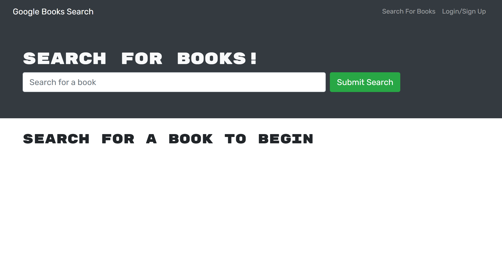

# Book Search Engine

## Description

This repository contains a Google Books API search engine that was personally refactored from provided RESTful API code to GraphQL API built with Apollo Server. The provided code was built using the MERN stack, with a React front end, MongoDB database, and Node.js/Express.js server and API.

It features my following capabilities: 

* Set up an Apollo Server to use GraphQL queries and mutations to fetch and modify data, replacing the existing RESTful API.

* Modify the existing authentication middleware so that it works in the context of a GraphQL API.

* Create an Apollo Provider so that requests can communicate with an Apollo Server.

## Usage

Through the terminal, install the required tools using the following: 

```
npm i
```

Through the terminal, initialize the application using the following:

```
npm run start
```

This website can be accessed at 

Below is a screenshot of the deployed application. 


